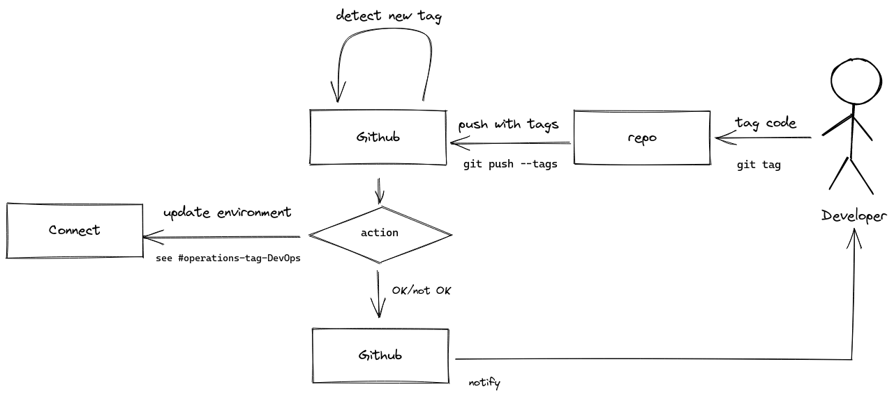

# Deployment

## Action

The action purpose is described in this diagram:

Action has the following configuration (right now embedded in the environment section):

* `API_URL`: the URL for Connect API endpoint
* `SERVICE_PK`: the Service ID to deploy the extension code to
* `ENVIRONMENT_ID`: the environment ID to update

Action does the following:

1. Gets the state of the environment from Connect
2. Stops it if it is running
3. Updates the tag on the environment
4. Starts it if it were running on step #1.
