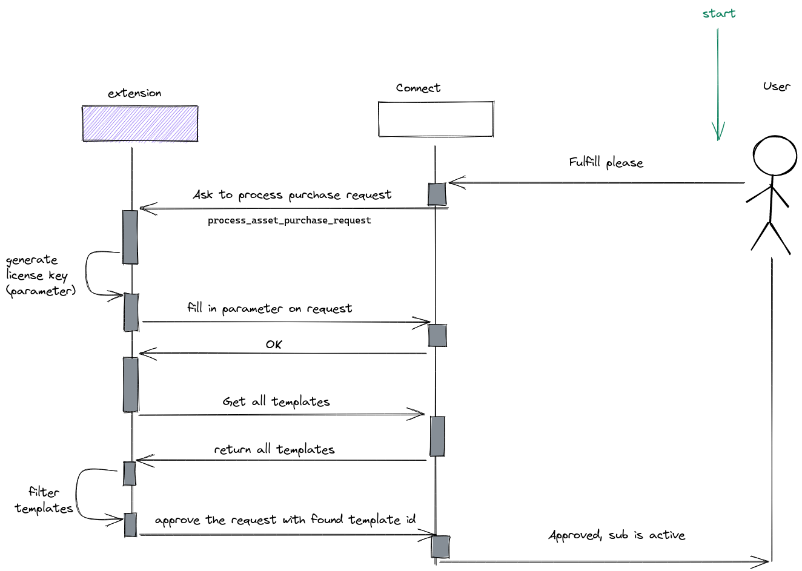

# Welcome to Auto approval extension !

Extension that automatically approves incoming fulfillment requests.

Upon receiving a fulfillment request, it will generate a uuid4 and store it as the fulfillment parameter `volume_license` and then approve the request.

# Overview

Diagram of what the extension does:

## License

**Auto approval extension** is licensed under the *Apache Software License 2.0* license.

